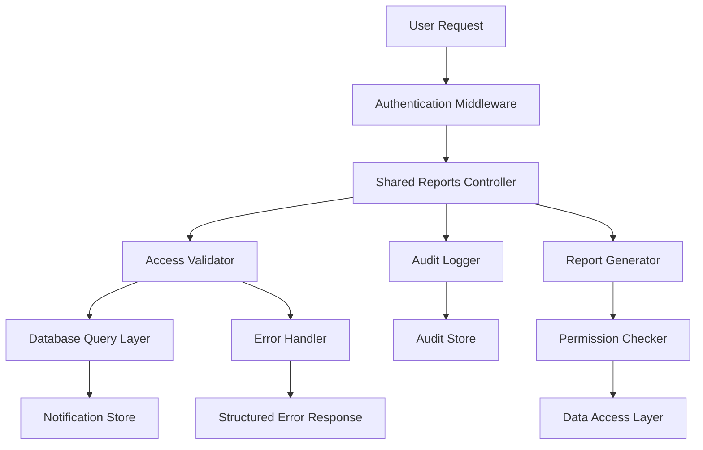

# Design Document: Shared Reports Access Fix

## Overview

This design addresses the critical 403 "Access denied" errors occurring in the shared reports functionality of AttriSense. The current implementation has issues with user ID type mismatches, inconsistent database queries, and inadequate error handling. This design provides a comprehensive solution that ensures reliable report sharing, proper access control, and robust error handling.

## Architecture

### Current Issues Identified

1. **Type Mismatch**: User IDs stored as strings but compared as numbers (or vice versa)
2. **Inconsistent Queries**: Different endpoints use different notification filtering criteria
3. **Missing Debug Information**: Insufficient logging to diagnose access failures
4. **Data Format Inconsistency**: Recipient lists stored in different formats across the system

### Proposed Architecture



## Components and Interfaces

### 1. Shared Reports Controller

**Responsibilities:**
- Handle HTTP requests for shared reports operations
- Coordinate between access validation, report generation, and audit logging
- Provide consistent error responses

**Key Methods:**
- `getSharedReportsList(userId: string): Promise<SharedReport[]>`
- `getSharedReportContent(reportId: string, userId: string): Promise<ReportContent>`
- `downloadSharedReport(reportId: string, userId: string, format: string): Promise<Buffer>`

### 2. Access Validator

**Responsibilities:**
- Validate user access to shared reports
- Handle different user ID formats consistently
- Check expiration dates and permissions

**Key Methods:**
- `validateAccess(reportId: string, userId: string): Promise<AccessResult>`
- `normalizeUserId(userId: any): string`
- `checkExpiration(expiresAt: Date): boolean`

### 3. Report Generator

**Responsibilities:**
- Generate fresh report data based on original parameters
- Respect original sharer's permissions
- Handle different report types consistently

**Key Methods:**
- `generateReportData(reportType: string, originalParams: any, sharerPermissions: UserPermissions): Promise<ReportData>`
- `formatReportForDisplay(reportData: ReportData, metadata: ShareMetadata): Promise<FormattedReport>`

### 4. Audit Logger

**Responsibilities:**
- Log all shared report access attempts
- Provide correlation IDs for request tracking
- Enable debugging and monitoring

**Key Methods:**
- `logAccessAttempt(userId: string, reportId: string, result: AccessResult): Promise<void>`
- `logError(error: Error, context: RequestContext): Promise<void>`

## Data Models

### SharedReportMetadata

```typescript
interface SharedReportMetadata {
  reportId: string;
  reportType: string;
  sharedBy: string;
  sharedWith: string[]; // Always array of string user IDs
  message: string;
  expiresAt: Date;
  createdAt: Date;
  isActive: boolean;
}
```

### AccessResult

```typescript
interface AccessResult {
  allowed: boolean;
  reason?: string;
  userId: string;
  reportId: string;
  timestamp: Date;
}
```

### ReportContent

```typescript
interface ReportContent {
  reportId: string;
  reportType: string;
  data: any;
  metadata: {
    sharedBy: string;
    sharedByName: string;
    sharedAt: Date;
    message: string;
  };
  generatedAt: Date;
}
```

## Correctness Properties

*A property is a characteristic or behavior that should hold true across all valid executions of a system-essentially, a formal statement about what the system should do. Properties serve as the bridge between human-readable specifications and machine-verifiable correctness guarantees.*

### Property 1: Share Creation Consistency
*For any* valid report sharing request with valid recipient user IDs, creating the share should result in a retrievable shared report record with all required metadata fields populated correctly.
**Validates: Requirements 1.1, 1.4, 7.1**

### Property 2: Access Token Uniqueness
*For any* set of shared reports created in the system, all report access tokens should be unique across the entire system.
**Validates: Requirements 1.2**

### Property 3: Notification Creation Completeness
*For any* successful report share operation, notifications should be created for exactly the number of recipients specified in the share request.
**Validates: Requirements 1.3**

### Property 4: Recipient Validation
*For any* share creation request containing invalid or inactive user IDs, the system should reject the request and provide specific error information about which user IDs are invalid.
**Validates: Requirements 1.5**

### Property 5: Authorization Consistency
*For any* shared report and any user ID, the access validation should return the same result regardless of whether the user ID is provided as a string or number format.
**Validates: Requirements 2.1, 2.5**

### Property 6: Expiration Enforcement
*For any* shared report with an expiration date in the past, access attempts should be denied with an appropriate expiration message.
**Validates: Requirements 2.2**

### Property 7: Read Status Tracking
*For any* successful access to a shared report by an authorized user, the system should mark that specific user as having read that specific report.
**Validates: Requirements 2.3**

### Property 8: Report Data Generation Consistency
*For any* shared report accessed multiple times by the same authorized user, the generated report data should be consistent based on the original parameters and current data state.
**Validates: Requirements 3.1**

### Property 9: Metadata Completeness
*For any* shared report accessed by an authorized user, the response should include all required sharing metadata (sharer name, share date, message, report type).
**Validates: Requirements 3.2**

### Property 10: Permission Inheritance
*For any* shared report, the generated content should respect the data access permissions of the original sharer, not the current viewer.
**Validates: Requirements 3.3**

### Property 11: Download Permission Consistency
*For any* user who can view a shared report, that same user should also be able to download the report in any supported format.
**Validates: Requirements 4.3**

### Property 12: File Naming Convention
*For any* downloaded shared report, the filename should follow the pattern "shared-report-{reportId}-{timestamp}.{extension}" where reportId is truncated to 8 characters.
**Validates: Requirements 4.2**

### Property 13: List Filtering Accuracy
*For any* user requesting their shared reports list, the returned list should contain exactly those reports where the user appears in the sharedWith array and the report is not expired.
**Validates: Requirements 5.1**

### Property 14: List Metadata Completeness
*For any* shared report in a user's list, all required display fields (type, sharer name, share date, read status) should be present and non-null.
**Validates: Requirements 5.2**

### Property 15: Expiration Filtering
*For any* user's shared reports list, expired reports should not appear in the main list but should be identifiable through a separate query.
**Validates: Requirements 5.3**

### Property 16: Sort Order Consistency
*For any* user's shared reports list with multiple reports, the reports should be ordered by share date with the most recent first.
**Validates: Requirements 5.5**

### Property 17: Access Logging Completeness
*For any* shared report access attempt (successful or failed), an audit log entry should be created with user ID, report ID, timestamp, and result.
**Validates: Requirements 6.1**

### Property 18: Debug Information Availability
*For any* shared report access failure when debug mode is enabled, the logs should contain user ID, report ID, access validation steps, and failure reason.
**Validates: Requirements 6.2**

### Property 19: Error Message Differentiation
*For any* two different types of access failures (not found vs. expired vs. unauthorized), the system should return distinct error messages that clearly indicate the specific failure type.
**Validates: Requirements 6.3**

### Property 20: Correlation ID Consistency
*For any* request to the shared reports system, all log entries related to that request should contain the same correlation ID for traceability.
**Validates: Requirements 6.5**

### Property 21: Data Format Consistency
*For any* shared report stored in the system, the sharedWith field should always be stored as a JSON array of string user IDs, regardless of input format.
**Validates: Requirements 7.2**

### Property 22: Creation Validation Round Trip
*For any* shared report creation, the system should be able to immediately retrieve the created record with all original data intact.
**Validates: Requirements 7.3**

### Property 23: Deactivated User Handling
*For any* shared report where the sharer or a recipient has been deactivated, access attempts should handle the deactivation gracefully without system errors.
**Validates: Requirements 7.4**

### Property 24: Caching Consistency
*For any* frequently accessed shared report metadata, subsequent requests within the cache timeout period should return identical data without additional database queries.
**Validates: Requirements 8.5**

## Error Handling

### Error Categories

1. **Authentication Errors (401)**
   - Invalid or expired JWT tokens
   - Missing authentication headers

2. **Authorization Errors (403)**
   - User not in shared report recipients list
   - Attempting to access expired reports
   - Insufficient permissions for report generation

3. **Not Found Errors (404)**
   - Shared report does not exist
   - Referenced users do not exist

4. **Validation Errors (400)**
   - Invalid report ID format
   - Invalid user ID format
   - Missing required parameters

5. **Expiration Errors (410)**
   - Shared report has expired
   - Access token no longer valid

6. **Server Errors (500)**
   - Database connection failures
   - Report generation failures
   - File system errors during downloads

### Error Response Format

```typescript
interface ErrorResponse {
  error: {
    code: string;
    message: string;
    details?: any;
    correlationId: string;
    timestamp: Date;
  };
}
```

### Logging Strategy

- **INFO**: Successful operations, access grants
- **WARN**: Access denials, expired report access attempts
- **ERROR**: System failures, database errors, unexpected exceptions
- **DEBUG**: Detailed validation steps, user ID comparisons, query results

## Testing Strategy

### Unit Testing Approach

**Focus Areas:**
- Access validation logic with different user ID formats
- Report metadata parsing and validation
- Error message generation for different failure scenarios
- User ID normalization functions

**Key Test Cases:**
- Valid access with string user IDs
- Valid access with numeric user IDs
- Access denial for unauthorized users
- Access denial for expired reports
- Proper error message generation

### Property-Based Testing Configuration

**Testing Framework:** Use existing testing framework with property-based testing library
**Test Iterations:** Minimum 100 iterations per property test
**Test Data Generation:** 
- Random user IDs (string and numeric formats)
- Random report metadata with various expiration dates
- Random recipient lists of different sizes

**Property Test Tags:**
Each property test must include a comment with the format:
**Feature: shared-reports-access-fix, Property {number}: {property_text}**

### Integration Testing

**Database Integration:**
- Test with actual PostgreSQL database
- Verify notification queries work correctly
- Test concurrent access scenarios

**API Integration:**
- Test complete request/response cycles
- Verify authentication middleware integration
- Test file download functionality

### Performance Testing

**Load Testing:**
- Concurrent access to same shared report
- Large recipient lists (100+ users)
- Bulk report generation

**Response Time Testing:**
- Report list retrieval under 2 seconds
- Report content generation under 10 seconds
- Download generation under 15 seconds

## Implementation Notes

### Database Schema Updates

No schema changes required, but ensure consistent data formats:
- All user IDs stored as strings in JSON arrays
- Proper indexing on metadata->>'reportId' for query performance

### Backward Compatibility

- Support both string and numeric user ID formats during transition
- Maintain existing API response formats
- Preserve existing notification structures

### Security Considerations

- Validate all user inputs to prevent injection attacks
- Ensure proper session management for long-running downloads
- Implement rate limiting for report generation endpoints
- Audit all access attempts for security monitoring

### Performance Optimizations

- Cache frequently accessed shared report metadata
- Use database connection pooling for concurrent requests
- Implement streaming for large file downloads
- Add database indexes for common query patterns